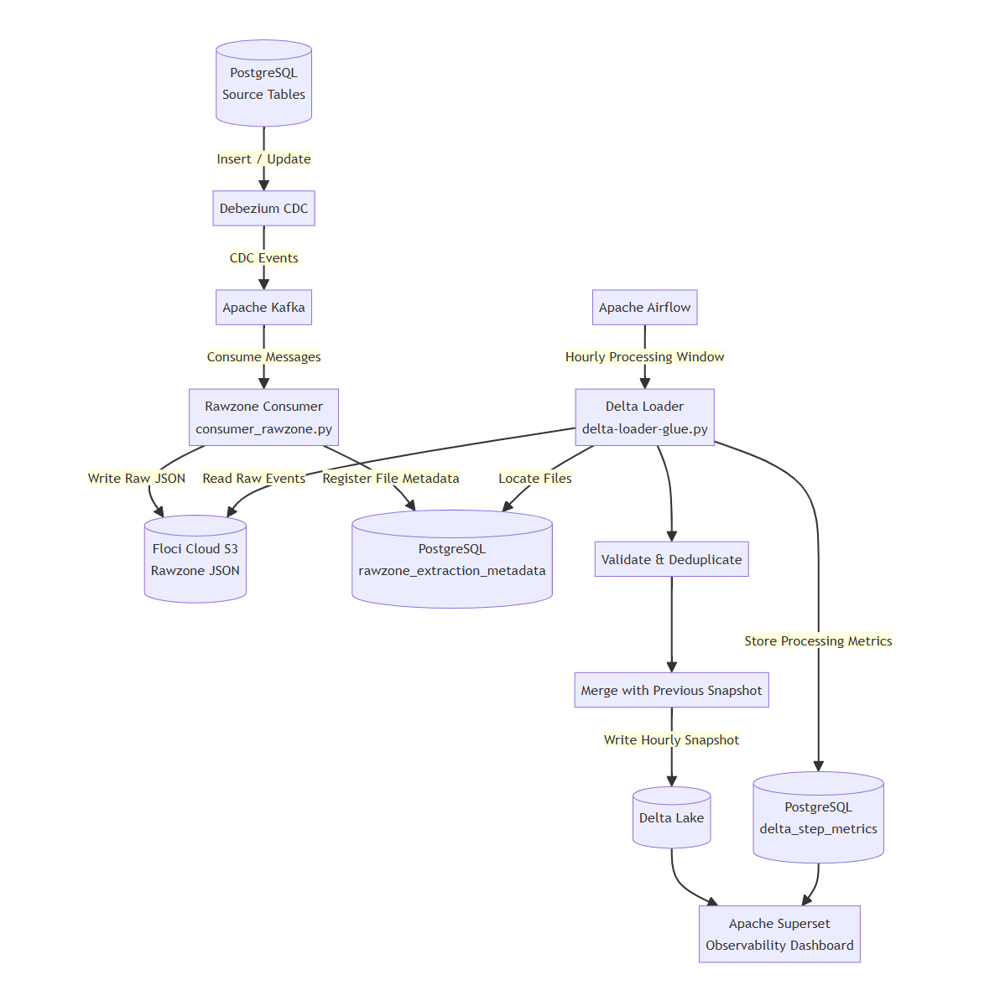

# DataWatch Observability Platform

> **Real-time Data Observability and Delta Lake Processing Platform** built with PostgreSQL CDC, Apache Kafka, Delta Lake, Apache Airflow, and Apache Superset.


## Overview

DataWatch is a config-driven data engineering platform that captures PostgreSQL changes using Debezium and Kafka, writes raw CDC events to an S3-compatible raw zone, builds cumulative Delta Lake snapshots, and records step-level processing metrics in PostgreSQL.

The project is designed to demonstrate CDC ingestion, lakehouse processing, backfill handling, deduplication, orchestration, and data observability using a locally reproducible environment.


## Key Features

* PostgreSQL change data capture using Debezium
* Kafka-based event streaming
* Multi-client and multi-collection configuration
* Raw CDC event storage in LocalStack S3
* PostgreSQL metadata tracking for every rawzone object
* Schema validation and rejected-record tracking
* Deduplication using merge keys and Debezium source timestamps
* Delta Lake transaction logs and versioned Parquet files
* Cumulative hourly snapshots
* Deterministic reruns and backfill support
* Parallel collection processing using `ThreadPoolExecutor`
* Thread-safe PostgreSQL connection pooling
* Step-level observability metrics
* Airflow-based hourly orchestration

---
## Flow Diagram

<p align="center">
  
</p>


## Technology Stack

| Category            | Technology                |
| ------------------- | ------------------------- |
| Source/Metadata store | PostgreSQL          |
| Change Data Capture | Debezium                  |
| Streaming           | Apache Kafka              |
| Object storage      | Floci-cloud S3             |
| Lakehouse format    | Delta Lake                |
| Processing          | Python, PyArrow, delta-rs |
| Orchestration       | Apache Airflow            |
| Visualization       | Apache Superset           |
| Containerization    | Docker                    |
| Cloud SDK           | Boto3                     |


## Pipeline Flow

### 1. Source Changes

Records are inserted, updated, or deleted in PostgreSQL tables such as:

```text
ecommerceapp.orders
```

Debezium captures these changes and publishes CDC events to Kafka topics.

Example topic:

```text
pg_rb.public.orders
```

### 2. Rawzone Ingestion

`consumer_rawzone.py` consumes Kafka messages, transforms them into a normalized rawzone structure, and writes each event to S3.

Example rawzone path:

```text
s3://rawzone/client1/orders/date=20260714/hour=01/<event-id>.json
```

The consumer also inserts an entry into:

```text
rawzone_extraction_metadata
```

The metadata table is used by the Delta Loader to locate files for a specific processing window.

### 3. Delta Lake Processing

`delta-loader-glue.py` processes one or more collections for a supplied hourly window.

Processing steps:

1. Query rawzone metadata for the requested window
2. Read matching JSON files from S3
3. Validate required fields
4. Separate valid and rejected records
5. Deduplicate records using the configured merge key
6. Read the previous hourly Delta snapshot
7. Merge previous state with current CDC records
8. Keep the latest record using `__source_ts_ms`
9. Write the current hourly Delta snapshot
10. Insert processing metrics into PostgreSQL

---


## Rerun Behaviour

Processing the same window again does not create duplicate active records.

The loader:

1. Reads the previous hourly snapshot
2. Reads the current window’s rawzone records
3. Deduplicates by merge key
4. Rebuilds the target snapshot
5. Overwrites the current Delta version

Delta Lake preserves transaction history through `_delta_log`, while the current table exposes only active records.


---

## Future Scope:
* Data reconciliation framework
* Cross-layer count validation
* Data freshness checks
* Schema evolution handling
* Multi-client observability dashboard
* Automated failure alerts
* Iceberg table support
